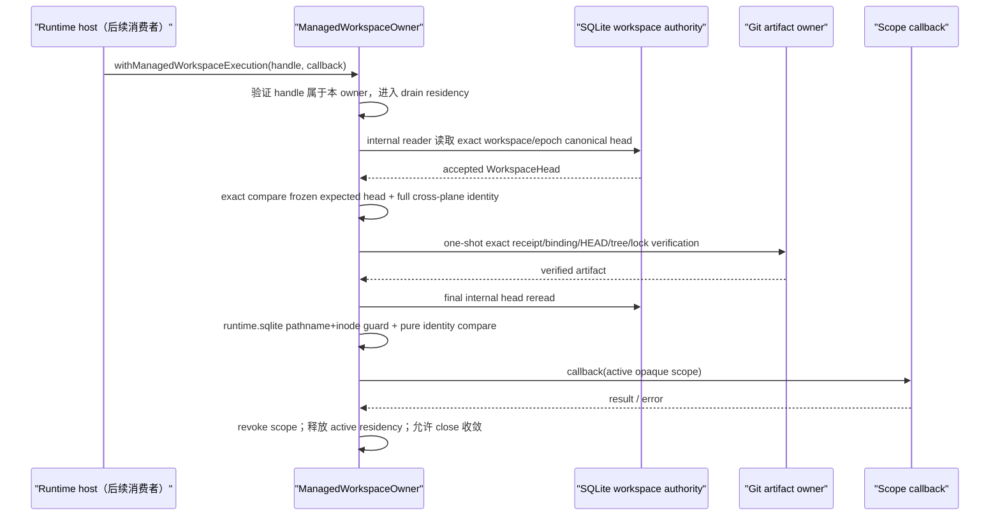

<!--
  Licensed to the Apache Software Foundation (ASF) under one
  or more contributor license agreements.  See the NOTICE file
  distributed with this work for additional information
  regarding copyright ownership.  The ASF licenses this file
  to you under the Apache License, Version 2.0 (the
  "License"); you may not use this file except in compliance
  with the License.  You may obtain a copy of the License at

      http://www.apache.org/licenses/LICENSE-2.0

  Unless required by applicable law or agreed to in writing,
  software distributed under the License is distributed on an
  "AS IS" BASIS, WITHOUT WARRANTIES OR CONDITIONS OF ANY
  KIND, either express or implied.  See the License for the
  specific language governing permissions and limitations
  under the License.
-->

# Managed Workspace Execution Admission v1：M1.1 可撤销 scope 门

- 状态：M1.1 已实现；M1.2 owner-bound worker bridge 与 runtime-host composition 当前切片；尚未由 Desktop/CLI 默认启用
- 更新日期：2026-08-04
- 主要不变量：同一个 `ManagedWorkspaceOwner` 只能用其亲自签发的进程内 execution handle 创建 active
  execution scope；一次 admission 只签发一个 scope，但同一 handle 允许多个只读 admission 并发。每次创建
  scope 前重新证明 exact SQLite workspace head 与 exact Git artifact，公共 API 永不发布 raw cwd，callback
  退出后 scope 立即失效
- lifecycle / admission owner：`ManagedWorkspaceOwner`
- durable truth：SQLite immutable workspace RuntimeEvents
- artifact evidence：Maka-owned Git binding、baseline receipt、HEAD/tree 与 ownership lock

## 1. 本切片交付什么

M0 已经能创建或 exact-adopt 一个 managed baseline，并把 Git receipt 与 SQLite canonical head 组合接受。
但 raw `worktreePath` 是不可撤销字符串，调用者可以永久缓存并绕过 owner close、后续 revalidation 和未来
workspace version 变化。因此 M1.1 使用两级进程内 capability：baseline 返回 owner-bound execution handle；
每次 admission callback 只得到 active execution scope，不得到 path。

```ts
const accepted = await owner.openManagedWorkspaceBaseline(store, identity);

await owner.withManagedWorkspaceExecution(accepted.executionHandle, async (scope) => {
  // M1.2 的 storage-internal worker bridge 才能消费 active scope。
});
```

`openManagedWorkspaceBaseline(...)` 不再公开 raw binding、receipt 或 `worktreePath`。handle 的内部证据保存在
未从 package root 导出的模块中，并使用 `WeakMap` 与 owner token 绑定；复制相同字段或使用另一个 owner 的
handle 都不能获得执行权限。scope 同样由 `WeakMap` 保存真实状态，callback 退出后即使被闭包保留也只能得到
typed `ManagedWorkspaceExecutionAuthorityError`，其稳定 code 为
`managed_workspace_execution_scope_expired`；伪造 scope 的 code 为
`managed_workspace_execution_scope_invalid`。

本切片没有接入 Desktop、CLI 或 ToolRuntime。它只建立 host 后续接线必须消费的唯一准入 API，不同时跨越
runtime protocol、host lifecycle 与工具 I/O 三个边界。

## 2. Owner、原子性边界、失败状态与回滚

| 项目 | 决策 |
|---|---|
| execution admission owner | 只有签发 handle 的同一个 `ManagedWorkspaceOwner` 可以消费它 |
| durable authority | handle/scope 都不是 durable fact；canonical head 通过注册时捕获的 storage-internal reader 读取，不调用可被 caller shadow 的 public method |
| 原子性边界 | 不虚构 Git 与 SQLite 之外的新事务；在 owner/root lease residency 内先完成 exact receipt/binding/Git verification，再以 immutable SQLite workspace head 作为 scope 签发前最后一次 durable reread；随后执行 DB pathname/inode guard 和纯内存 identity compare，不再运行慢速 Git 命令 |
| 执行期间 | 每个 callback 分别计入 owner active operation；同一 handle 可并发多个 `workspaceEffect: none` scope；`close()` 等全部 scope drain，新 admission 在 closing 后被拒绝 |
| invalid handle | `managed_workspace_execution_handle_invalid`；不签发 scope |
| foreign / expired scope | `managed_workspace_execution_scope_invalid` / `managed_workspace_execution_scope_expired`；bridge 不解析 cwd、不 dispatch worker |
| worker 缺失 | `managed_workspace_worker_unavailable`；不从 managed mode fallback 到 host-local I/O |
| mutation / unknown operation | `managed_workspace_operation_denied`；Write/Edit/Format/Bash/未知 operation 在 worker dispatch 前 fail closed |
| canonical head 漂移/缺失 | fail closed；旧 handle 不能自行选择新 head |
| artifact drift | 不签发 scope；所有 Git verification 阶段的 `managed_workspace_drifted` 统一 quarantine |
| mutation permission | scope 固定 `workspaceEffect: none`；M2 前没有 raw cwd consumer，Write/Edit/Bash/未知工具不得接入 |
| 回滚 | 无新增 schema 或 durable admission row；停止调用 API 即回滚能力，已接受的 baseline history 与 artifact 不变 |

## 3. 每次执行的时序



这不是跨 SQLite/Git/filesystem 的共同事务。它关闭 cooperating Maka writer 的 proof-to-scope seam；任意外部
进程仍可能在最后一次 filesystem observation 后制造 drift，后续 admission 会 fail closed。普通生产路径只执行
图中的一次 final Git verification；只有配置 production-shaped crash failpoint 的测试路径才先执行一次 preliminary
verification，以便在真实 proof 完成后 `SIGKILL`，随后仍必须再次执行 final verification 才能签发 scope。M1.2 的 worker/
sandbox 建立实际 I/O 隔离，M2 才负责 mutating tool 产生 successor candidate 并接受新 workspace version。

## 4. Provisioning 与实际可用性边界

本切片 scope 的 provisioning 固定为 `canonical_tree_only_v1`，且 `workspaceEffect` 固定为 `none`。底层
artifact 只包含 accepted Git tree：

- 不复制 source checkout 的 ignored/untracked 文件；
- 不复制 `.env`、credential、`node_modules` 或 build cache；
- 不自动运行安装命令；
- 不把 scratch/build output 偷偷写入 canonical baseline；
- 不从 managed profile 静默 fallback 到 attached checkout。

因此 M1.1 可用于验证纯 tracked-tree 读取和后续受控工具接线，但还不宣称一般开发任务已经可用。
ignored dependency、secret 与 scratch overlay 必须作为独立 M1 provisioning 切片，写明数据来源、生命周期、
泄露边界和清理方式后才能接入。

## 5. Crash、并发与外部 drift 矩阵

| 场景 | 必须结果 |
|---|---|
| baseline 已接受，签发 handle 前崩溃 | 重启后从 canonical head 与 receipt 重新签发新 handle |
| execution verification 中崩溃 | 没有 durable “half admission”；旧 handle 随进程消失 |
| crash-test preliminary verification 后 drift | final exact receipt/Git verification 检测并 quarantine；scope 不签发 |
| 同一 handle 的两个只读 callback 并发 | 两个 scope 可同时 active，彼此独立 revoke |
| 多个 callback 运行时 owner close | close 等全部 callback drain；不取消已 admission operation |
| closing 后新 execution 请求 | `managed_workspace_owner_closing` |
| forged / cross-owner handle | `managed_workspace_execution_handle_invalid` |
| callback 保存 scope 后再次使用 | scope 已 expired，internal consumer 必须拒绝 |
| callback 抛错 | scope 仍在 finally 中 revoke，owner residency 正常释放 |
| worker 在返回结果前失败 | worker error 结束本次 operation；callback 的 finally revoke scope，owner residency 被释放，后续 close 可收敛 |
| worker timeout / abort | production `FilesystemWorkerClient` 终止并等待 one-shot worker process tree 与 I/O drain 后才 reject；scope 在此之后 revoke |
| worker 已启动时 host process crash | M1.2 不承诺跨平台 parent-death kill；worker 仍受 read-only sandbox 与单次请求约束，不能留下 workspace mutation，且完成或超时后退出；新 host 必须重新 admission。Shell/Write/Edit 不得借此 seam 执行 |
| 用户直接编辑 Maka-owned worktree | 系统不能物理阻止；下一次 admission 检测 drift 并 fail closed/quarantine |
| 重启后恢复 | 新 root owner、新 managed owner、新 handle；不可恢复旧进程内 capability |

production-shaped 测试使用真实 pinned Git、真实 SQLite、真实子进程和 `SIGKILL`，证明 execution artifact
verification 中断后，重启只能经完整 reopen/revalidate 获得新 scope authority；真实 Git 并发测试证明两个
只读 scope 可以并行，且 `close()` 必须等待二者全部退出。

filesystem worker 是 one-shot request/response process。它的 `execute()` 合同要求 Promise 只有在该次操作及其
拥有的 process lifecycle 已终止后才能 settle；storage owner 因而以这个 Promise 作为 execution residency，
不再增加一个无法约束真实进程的装饰性 lease。正常返回、worker error、timeout 与 abort 都必须先由现有
`FilesystemWorkerClient` / process runner 收敛，再退出 callback 并 revoke scope。host 被 `SIGKILL` 时无法执行
JavaScript finally，因此本切片的安全保证来自“只读 operation allowlist + read-only sandbox”，而不是虚构所有平台
都具备 parent-death cleanup。需要 durable handle 的 ShellRun 继续留在后续独立阶段。

## 6. 平台能力矩阵

| 能力 | Linux | macOS | Windows |
|---|---|---|---|
| owner-bound opaque handle | 支持 | 支持 | 支持 |
| exact SQLite/Git/head/tree revalidation | 支持 | 支持 | 支持 |
| callback drain | 支持 | 支持 | 支持 |
| process crash 后重新准入 | 支持 | 支持 | 支持（进程级；不宣称断电 durability） |
| external drift quarantine | 支持 | 支持 | 有限支持，沿用 Git artifact owner 的 Windows 保证 |
| managed Read/Glob/Grep worker bridge | 需要可用的 Linux sandbox backend；缺失时 fail closed | 支持 seatbelt worker | 当前不支持；managed Host composition fail closed，不回退 host-local |
| runtime-host lifecycle composition | 支持 | 支持 | 支持生命周期与 typed profile，但 managed I/O 因 worker 不可用而拒绝 |
| power-loss durability | 不承诺 | 不承诺 | 不承诺 |

## 7. 后续切片

1. M1.2：owner-bound storage worker bridge 消费 active scope 并在内部解析 cwd；公共 caller 仍不获得 path。
   managed profile 在 M2 前只允许 `workspaceEffect: none` 的 Read/Glob/Grep；Write/Edit/Format/Bash/未知工具在
   worker dispatch 前 fail closed。无 ownerToken 的 inspect API 仅保留在显式 test support 中；callback 内
   reentrant `owner.close()` 由 execution-context guard 拒绝。runtime-host 使用不可混淆的 attached/managed
   typed profile；managed profile 只携带 opaque handle，绝不携带 attached cwd，也绝不 fallback。Host 先 drain
   tool operations，再关闭 workspace composition/managed owner，最后由 kernel 关闭 root owner。只有显式提供
   verified Git runtime 且 sandbox filesystem worker 可用时才组合 managed owner；否则保持未启用或 fail closed。
2. M1.3：显式 dependency/secret/scratch provisioning；首版若无法安全提供则保持
   `canonical_tree_only_v1`，不能 silent fallback。
3. M2：mutation candidate capture/accept；T1 前冻结 profile/base version，SQLite 原子接受 tool outcome
   与 successor workspace version。

M1.2 提供真实 runtime-host composition seam，但本切片不修改 Desktop/CLI 默认配置，因此不默认开启 managed
execution，也不改变 attached mode。ASF Desktop 已停止分发 bundled Git；在兼容许可证的 verified runtime
接入前，managed execution 必须在 admission/T1 前保持不可用，且不得回退系统 Git。
