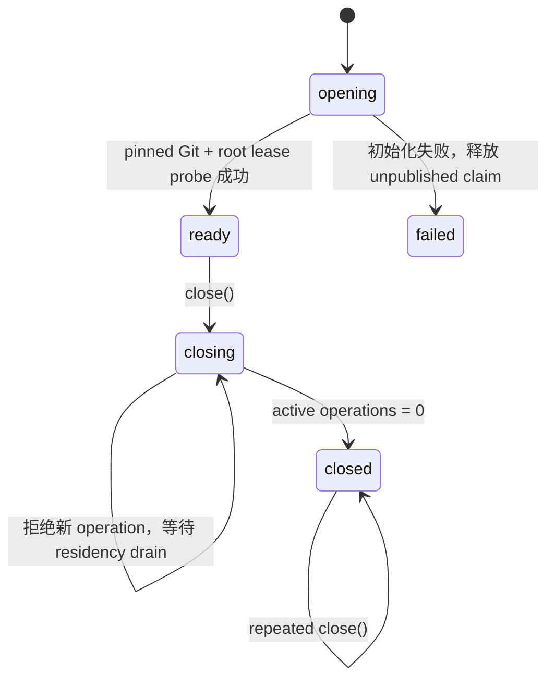

<!--
  Licensed to the Apache Software Foundation (ASF) under one
  or more contributor license agreements.  See the NOTICE file
  distributed with this work for additional information
  regarding copyright ownership.  The ASF licenses this file
  to you under the Apache License, Version 2.0 (the
  "License"); you may not use this file except in compliance
  with the License.  You may obtain a copy of the License at

      http://www.apache.org/licenses/LICENSE-2.0

  Unless required by applicable law or agreed to in writing,
  software distributed under the License is distributed on an
  "AS IS" BASIS, WITHOUT WARRANTIES OR CONDITIONS OF ANY
  KIND, either express or implied.  See the License for the
  specific language governing permissions and limitations
  under the License.
-->

# Managed Workspace Owner v1：M0 生命周期门

- 状态：已合并；M1 execution admission 继续复用本 owner 的 lifecycle/drain 门
- 更新日期：2026-08-04
- 主要不变量：一个 authenticated interactive storage-root owner 在其生命周期内至多发布一个
  managed workspace owner；已经 admission 的 workspace 操作必须在关闭前 drain
- artifact owner：`GitWorkspaceService`
- lifecycle owner：`ManagedWorkspaceOwner`
- canonical workspace history：仍由 Workspace Version Authority 拥有；M0 composition 只允许 owner 的
  `openManagedWorkspaceBaseline(...)` 通过 storage-internal writer 写入 baseline RuntimeEvents

## 1. 为什么需要独立 owner

`GitWorkspaceService` 能创建、验证、repair 与 quarantine Maka-owned Git artifacts，但它是一个
operation-scoped service；仅有它还不能回答：

- 哪一个 host 有权在当前 storage root 上驱动这些操作；
- 初始化进行中或失败时，是否可能发布半个可用 owner；
- shutdown 与进行中的 Git 操作谁先完成；
- Desktop、CLI 与 runtime-host 是否可能各自绕过同一生命周期门。

本切片把现有 authenticated `InteractiveRootOwner` 作为上层 lease authority。它不增加第二个 OS
owner lock，也不通过路径自行证明 ownership。

## 2. Owner、边界、失败状态与回滚

| 项目 | 决策 |
|---|---|
| 唯一 owner | 一个真实 `InteractiveRootOwner` 对象只能组合一个 `ManagedWorkspaceOwner` |
| 初始化边界 | pinned Git digest 验证与 storage-root authority probe 全部运行在 root write lease 内 |
| operation admission | 仅 `ready` 可 admission；每项操作同时持有 managed-owner residency 与 root lease operation |
| shutdown | `ready -> closing -> closed`；`closing` 拒绝新操作并等待已 admission 操作 drain |
| 初始化失败 | 返回 `managed_workspace_owner_unavailable`，释放未发布 claim，允许同一 root owner 修正后重试 |
| 重复组合 | 返回 `managed_workspace_owner_conflict` |
| drift | 不返回 drifted cwd；receipt/artifact 复验发现 drift 时 fail closed；复验后 reopen 竞态发现 drift 时 durable quarantine |
| 回滚 | 不接 Desktop/CLI/runtime-host，不改变 attached mode；可删除本 owner 而不改变 Git artifacts 或 RuntimeEvents |

owner 不关闭外层 `InteractiveRootOwner`。Runtime Host 仍拥有 root owner 的最终关闭顺序；managed owner
必须先关闭。反过来，如果 root owner 已开始关闭，lease revalidation 会阻止新的 managed operation。

## 3. 公开状态机

`opening` 与 `failed` 不作为已发布 owner 的可见状态。factory 只有在初始化完成并再次确认 root owner
仍然有效后才返回 `ready` owner。

## 4. Workspace gate

owner 的 public surface 开放两个连续、不可绕过的 workspace admission 操作：

1. `openManagedWorkspaceBaseline(store, identity)` 从 eligible clean source 创建/exact-adopt artifact，
   持久化并复验 receipt，再由 storage-internal writer 接受 canonical baseline，返回 owner-bound execution handle；
2. `withManagedWorkspaceExecution(handle, callback)` 在每次执行前重新证明 canonical head、receipt、HEAD/tree、
   ownership 与 root identity，只在 drain-managed callback 中签发可撤销 opaque scope；raw cwd 不进入
   public API。

artifact-only create/open 和 `GitWorkspaceService` factory 不从 package root 导出。调用者不能在 SQLite
acceptance 前取得 `worktreePath` 或裸 `ManagedWorkspaceBinding`。入口返回前必须验证 worktree、index、
HEAD、tree、ownership lock、canonical `runtime.sqlite` pathname/inode、durable receipt，以及最终时刻的
`InteractiveRootOwner`/root marker identity；任何失败都不能把 cwd 交给工具。SQLite 已提交而最终 owner
复验失败时，canonical history 保留，但本次调用不得发布 usable workspace。

本切片不扫描目录来猜测 workspace identity。Baseline Open Bundle 通过 Git artifact owner 的 durable
receipt 与 canonical workspace authority 绑定 exact identity；未接受 Git artifact 属于 orphan GC 范畴。

M1 execution admission 的详细合同见
[Managed Workspace Execution Admission v1](./runtime-managed-workspace-execution-admission-v1.zh-CN.md)。

## 5. Crash 与并发证明

| 场景 | 必须结果 |
|---|---|
| 同一 root owner 两次 open | 一个 ready；另一个 owner conflict |
| pinned Git 初始化失败 | 不发布 owner；修正 digest 后可重试 |
| operation admission 后 close | close 等待 operation；新 operation 被拒绝 |
| root owner 同时 close | root close 与 managed close 都等待同一 lease-bound operation |
| external drift 后 reopen | receipt/artifact 复验 fail closed；若发生在复验与 reopen 之间则 durable quarantine |
| post-commit artifact 复验后 root marker 被替换 | admission 时捕获的 lease identity guard 最终复验并拒绝；保留 canonical head，不发布 cwd；owner closing 只阻止新 admission，不误杀正在 drain 的操作 |
| repeated close | exact no-op，不重复释放外层 root owner |

Git artifact create/quarantine 的进程崩溃矩阵继续由 `GitWorkspaceService` 负责；本 owner 不复制第二套
repair 状态机。Baseline Open Bundle 将补充“startup 时先验证 canonical receipt，再按 exact binding
reopen/repair，最后才允许 baseline authority read”的组合顺序。

## 6. 平台能力矩阵

| 能力 | Linux | macOS | Windows |
|---|---|---|---|
| owner uniqueness / lifecycle | 支持 | 支持 | 支持 |
| root lease-bound operation drain | 支持 | 支持 | 支持 |
| pinned Git initialization | 支持 | 支持 | 支持 |
| external drift quarantine | 支持 | 支持 | 有限支持，沿用 Git service 的 Windows 承诺 |
| power-loss durability | 不承诺 | 不承诺 | 不承诺 |

## 7. 明确延期

- Desktop、CLI、runtime-host 接线与 managed-mode 设置；execution admission API 已建立，但尚无生产 host consumer；
- filesystem worker、mutation coordinator 与工具 cwd 切换；
- candidate refs、mutation repair、GC、replication outbox；
- ignored dependencies、build/test environment provisioning；
- Durable Write、workspace-bound continuation 与自动 resume。
- whole-root import 后既有 linked worktree 的 relocation/adoption；
- 非空 legacy database 的显式备份与 root-binding migration 工具。

这些能力不能借 owner lifecycle PR 顺手接入。Baseline Open Bundle 已作为本 owner 的第一个
canonical-fact consumer 完成组合，证明 Git baseline 与 RuntimeEvent baseline 不会只成功一半；后续
M1 execution admission 已从该 bundle 返回的 owner-bound handle 进入，未重新开放 artifact-only 旁路。
